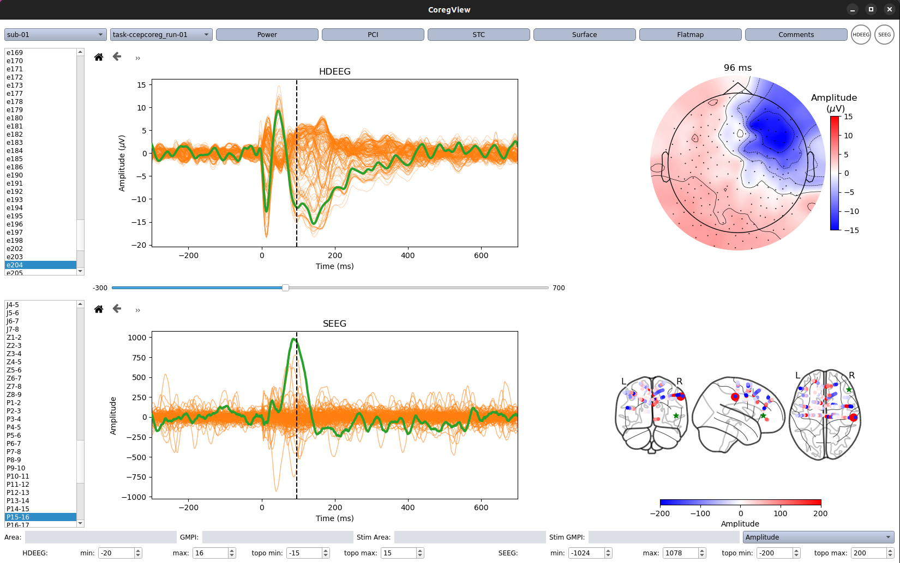

# CoregView
GUI for visualizing SEEG-HDEEG coregistered data acquired during intracranial electrical stimulation

## Install
To install the required packages please follow the installation instructions of the [mne-python](https://mne.tools/stable/index.html) library.

# Usage
After the enviroment has been propertly created, activate it with:

`conda activate mne` on a terminal.

Navigate to the folder where the scripts are and run the gui with:

`python coregview.py`.
